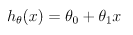
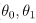
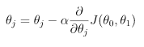
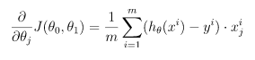

# Linear_regression
>Recoding from scratich a simple linear regression model with a single feature - the mileage of the car. 
>The program predicts the price of a car by using a linear function train with a gradient descent algorithm.
## 
Hypothesis: 
 
Params: 
 
Cost function: 
 
Gradien Descent: 
 
Derivative term: 
 

